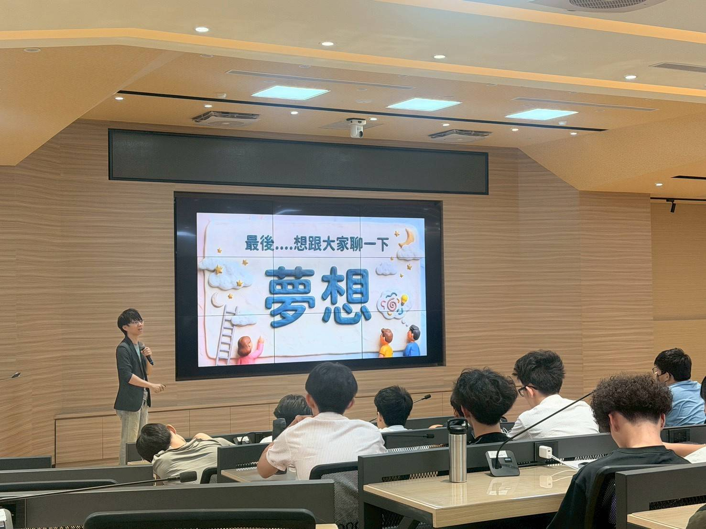
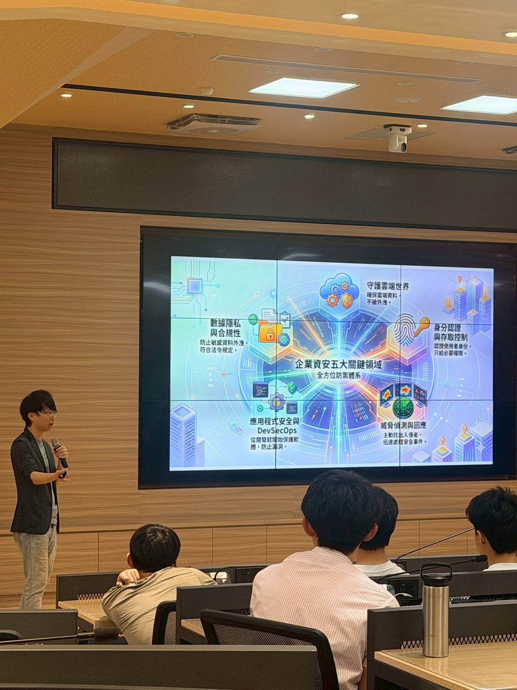
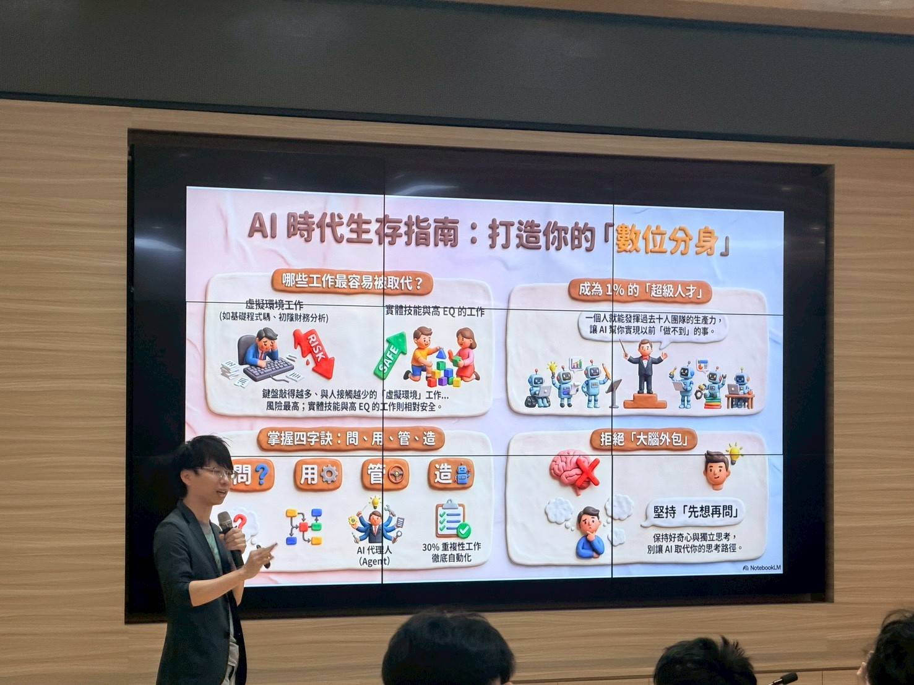
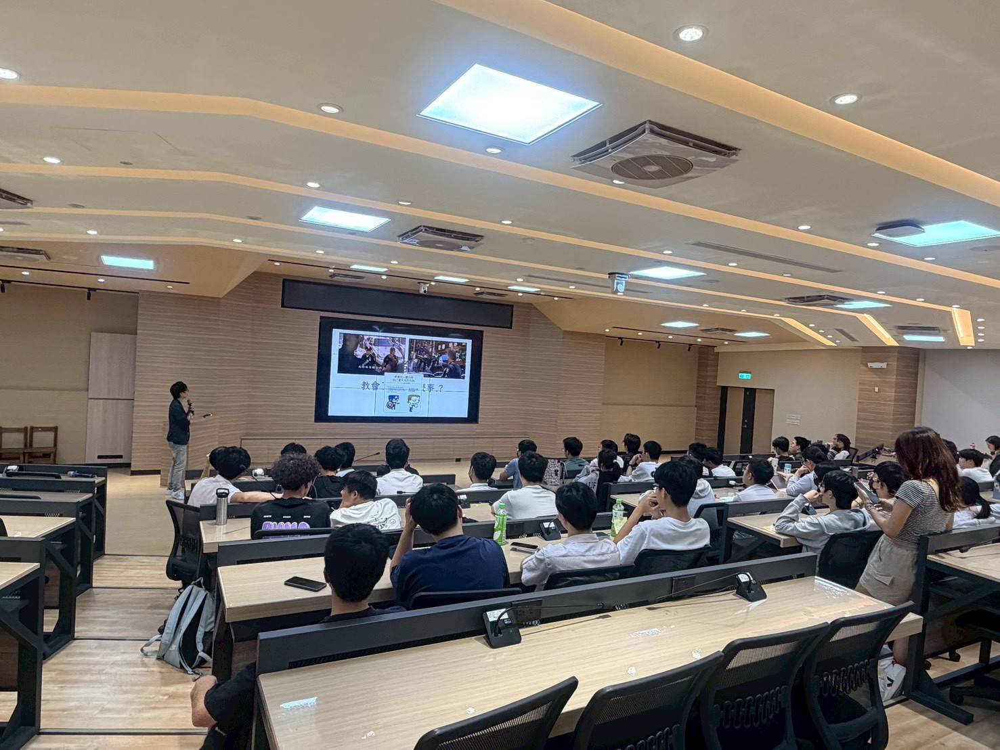
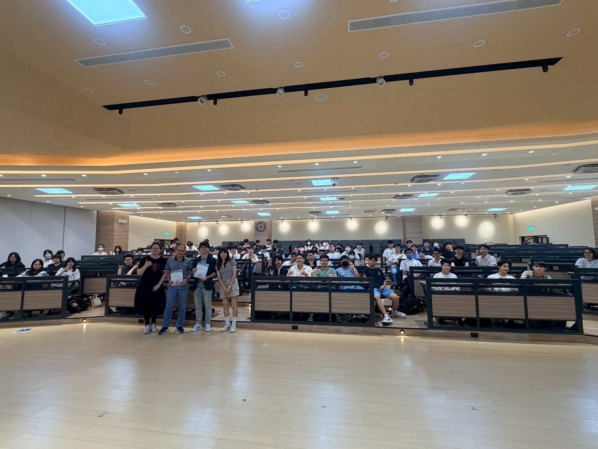

## AI時代下職涯轉變與π型人才的必要性

　　講座中，講師從人工智慧的快速發展切入，分析未來職場可能出現的結構性變化。其中，透過「是否為虛擬工作環境」、「是否需高度人際互動」以及「是否需情緒理解」等面向，將各類職業進行分類，並指出偏向虛擬、低互動的工作型態，較容易受到AI技術的影響與取代。此一分析提供了理解未來職場風險的具體框架，也突顯出科技發展對職涯穩定性的衝擊。在此背景下，傳統強調單一專業深度的培養模式，逐漸顯現其限制。隨著AI能夠處理大量重複性與規則性任務，單一技能的競爭力可能快速下降。因此，講師提出「π型人才」的概念，即個體在具備一項專業深度的同時，亦能延伸發展另一項跨領域能力，使其在不同情境中具備整合與應用的能力。此類型人才不僅能降低被單一技術取代的風險，也更能因應產業變動所帶來的挑戰。

　　此外，講師亦強調，人工智慧並非僅為取代人力的工具，同時也具備提升效率與強化能力的潛力。當個體能夠有效運用AI輔助學習與工作時，其產出與思考深度皆可能獲得顯著提升。因此，在AI時代中，關鍵不在於避免技術的影響，而在於能否將其轉化為提升自身能力的工具，進而建立新的競爭優勢。

* * *

## 大學作為探索與試錯的階段

　　另一位講師則從個人經驗出發，重新詮釋大學教育的定位，指出大學並非職涯的終點，而是探索方向的重要階段。科系的選擇雖然在短期內影響學習內容，但並不會完全決定未來的職業發展。 此觀點打破了傳統「選對科系即等於選對未來」的思維，強調個體在大學期間透過多元嘗試與持續調整，逐步形塑自身的發展方向。講師以自身經歷說明，從機械背景轉向數據分析領域的過程，並非一開始即明確規劃，而是在學習與實務經驗中逐漸發現興趣與能力的交集。此一案例顯示，職涯發展往往具有高度的不確定性，需透過長期探索與累積，方能逐漸確立方向。因此，大學階段的核心價值，並不僅在於專業知識的學習，更在於提供一個能夠試錯與修正的環境。

　　同時，講師亦指出，企業在評估人才時，除了學歷之外，更重視解決問題的能力、溝通能力與團隊合作能力。此一觀點突顯出能力導向的重要性，也意味著單純依賴考試成績，難以全面反映個體在職場中的潛力。因此，在學習歷程中，透過社團參與、跨領域課程以及實務專案等方式，累積多元經驗，將有助於提升整體競爭力。

* * *

## 對AI取代論的反思與未來定位

　　儘管講師所提出的「工作取代模型」提供了一套理解AI影響的分析架構，但其適用性仍值得進一步思考。以心理諮商師為例，此類職業涉及高度人際互動與情緒理解，理論上較難被AI取代。然而，隨著人工智慧技術的進步，像 ChatGPT 等語言模型，已逐漸具備回應情緒與提供支持的能力。在特定情境下，其穩定性與可及性甚至可能成為優勢。若未來結合更完整的心理學理論與數據分析，AI介入此類領域的可能性並非不存在。

　　因此，「是否會被取代」不應被視為靜態分類，而是一個隨技術發展而持續變動的動態過程。當科技能力不斷提升時，原先被認為安全的職業，也可能面臨轉型或重構的需求。在此情境下，預測特定職業的安全性，或許不如培養可轉移的能力來得重要。另一方面，講師亦提醒，人工智慧的普及可能導致過度依賴的問題。當學習者僅透過AI獲取答案，而缺乏對問題本質的理解與思考，將可能削弱其分析與判斷能力。因此，在AI時代中，關鍵不僅在於使用工具，更在於如何維持批判性思考，並將AI作為輔助理解與延伸思考的媒介，而非替代思考的工具。

　　綜合兩位講師的觀點，可見AI時代所帶來的並非單一方向的衝擊，而是一種全面性的轉變。面對此一趨勢，最重要的並非選擇一條「不易被取代」的道路，而是建立持續學習、跨領域整合與靈活應變的能力。唯有如此，方能在不確定性日益提高的環境中，維持長期的競爭力與發展空間。

## 講座紀錄

  
  
  
  

