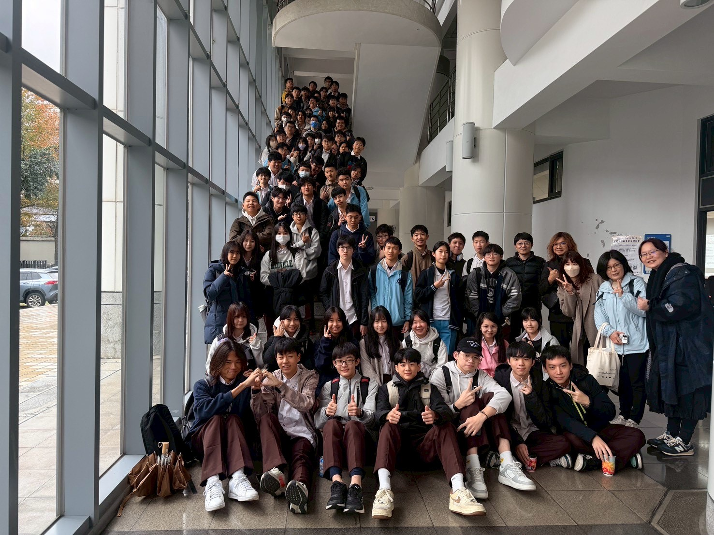
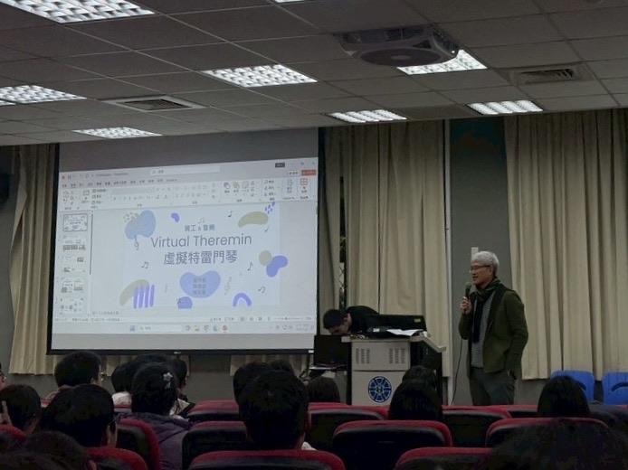
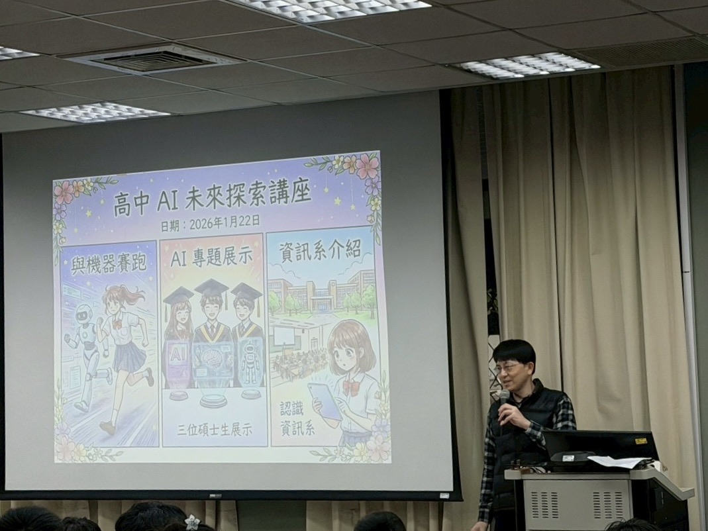

## From Competition to Campus: A Constant Dialogue with AI

Last November, at the Taipei Academic Subject Proficiency Competition, although I narrowly missed winning an award, Professor Chiang Tsung-che’s lecture on AI left a lasting impression on me. Today, I had the privilege of visiting National Taiwan Normal University (NTNU) for a campus visit and once again listened to Professor Chiang’s presentation. The theme again focused on how humans should respond to the rapid development of AI. Both lectures revolved around a core proposition: as technology continues to evolve, how can we avoid being replaced? This also reminded me of the recently popular topic of “Vibe Coding,” prompting some reflection.

## When code finds a heartbeat, are we finally awake?

During the lecture, Professor Chiang cited a set of key data: 800 million jobs will disappear in the future, but at the same time, 900 million new job vacancies will be created. The most important message behind these numbers is not the fluctuation in quantity, but the “drastic qualitative change” in the nature of labor. As a student in an information class, I have observed that the speed at which AI handles standardized documents and basic code is causing many jobs with clear procedures to lose their competitive threshold.

Once, writing programs was considered a “rare skill,” but in the flood of technology, it has gradually devolved into a “basic tool” of the digital age. This is skill inflation: in the past, knowing how to code was a bonus on a resume; now, without this ability, you might not even be able to stand at the starting line. When AI has already demonstrated a certain degree of “awakening” in logical operations, have humans also awakened? We must realize that truly valuable jobs in the future will no longer be mere executors of code, but “definers” of problems.

## The Algorithm’s Triumph and the Human Refutation

In my daily learning, I also frequently use Vibe Coding. It is undeniably highly efficient, with fast generation speed and stable quality, unaffected by fatigue or emotions. When AI can easily complete implementation tasks that previously required long-term training to master, I began to rethink: if my core value remains only at “writing correct syntax,” then this value is highly replaceable.

Programming is shifting from a core competency to a basic prerequisite. The real gap lies in the depth of understanding of the problem. In the process of collaborating with AI, I realized that although AI is powerful, it has inherent limitations: it will not actively question the rationality of requirements, it will not take responsibility for the success or failure of the system architecture, nor will it consider long-term maintenance risks. Therefore, the focus of learning must shift from “how to write” to “why it is written this way,” which includes:

-   Understanding the true purpose behind requirements, rather than just superficial functional implementation.
-   Mastering the limitations and potential risks of the system.
-   Possessing the planning ability to integrate scattered functions into a structured system.

## Where Syntax Dissolves: Vibe Coding — A Revolution of Intuition

Vibe Coding, as an emerging trend, allows developers to replace large amounts of handwritten code by describing requirements, which indeed greatly lowers the development threshold. However, the improvement in efficiency is often accompanied by challenges in quality control. Observing current open-source platforms, one can find many AI-generated projects that, although executable, hide significant problems, such as:

-   Cybersecurity risks like API Tokens or keys being directly exposed in the frontend.
-   Lack of architectural planning, making projects difficult to maintain and expand.
-   Lack of consistency in code logic.

This corresponds to the key point mentioned in the lecture: what is truly needed is no longer simple coders, but engineers who can make correct judgments in situations with incomplete information. AI can assist in generating code, but it cannot bear the consequences of architectural failures, nor can it handle decisions involving ethics and risk. Vibe Coding is a double-edged sword; it reduces the difficulty of realizing ideas but raises the professional requirements for a developer’s judgment.

## Conclusion

In summary, the rise of AI will accelerate the elimination of “single-function” technical personnel. The truly core competitiveness of the future lies not in which programming language or framework you have mastered, but in systems thinking, problem decomposition ability, cross-disciplinary understanding, and sensitivity to real-world needs.

The biggest difference between humans and machines lies in emotion, decision-making power, and life experience. AI will not feel a sense of accomplishment for replacing humans, but humans will face a survival crisis for losing their value. We should view AI as the strongest tool for enhancing self-value, using it to release the burden of tedious implementation and focus on higher-level judgment and creation. If an engineer’s entire value consists only of “writing code,” then being replaced is only a matter of time; but if we can combine the efficiency of AI with the value of human decision-making, then this technological wave will become our best ally.

## Picture Record

  
  

