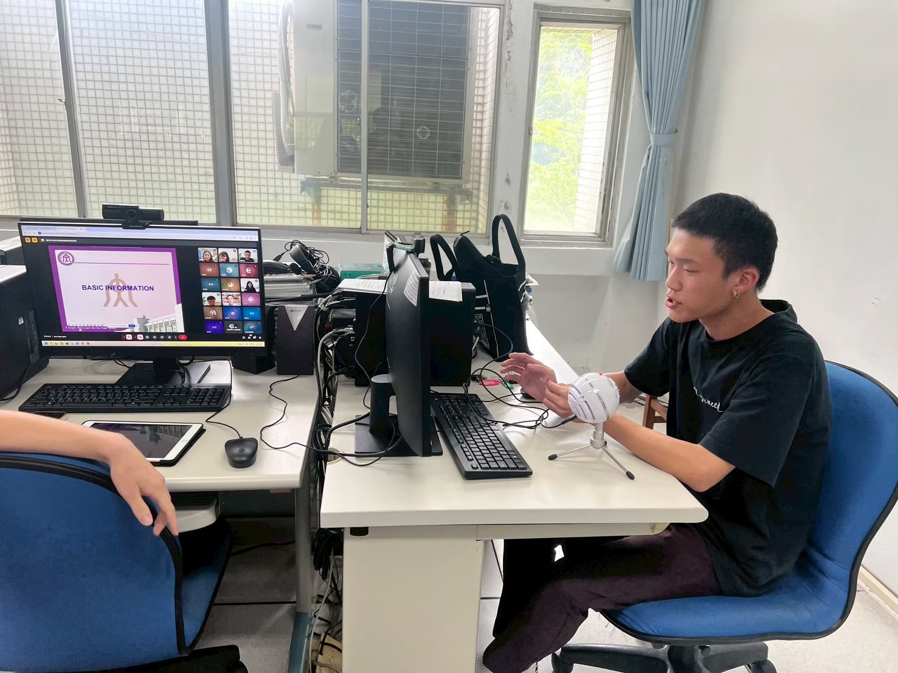
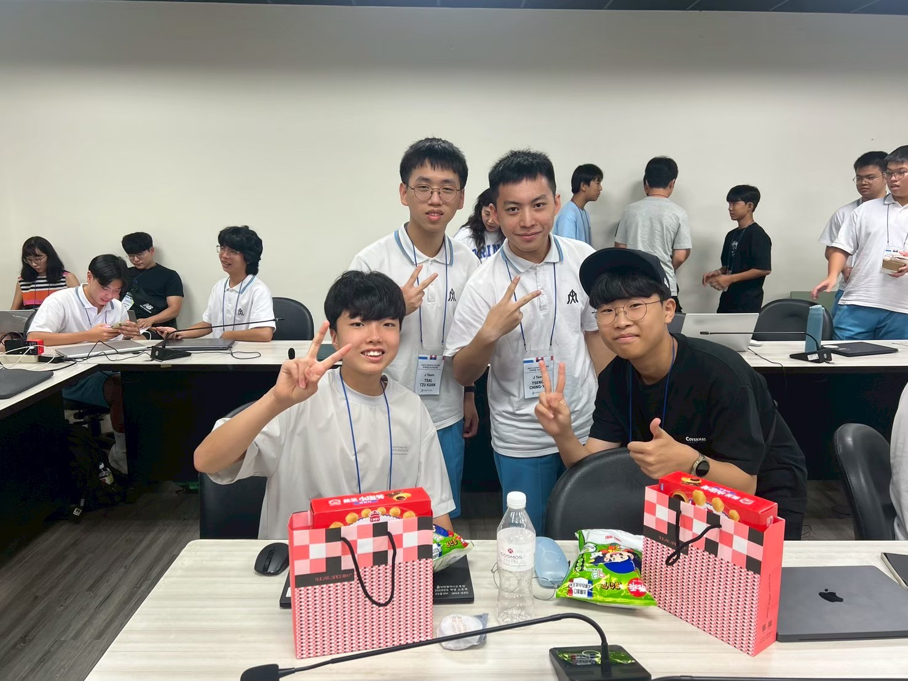
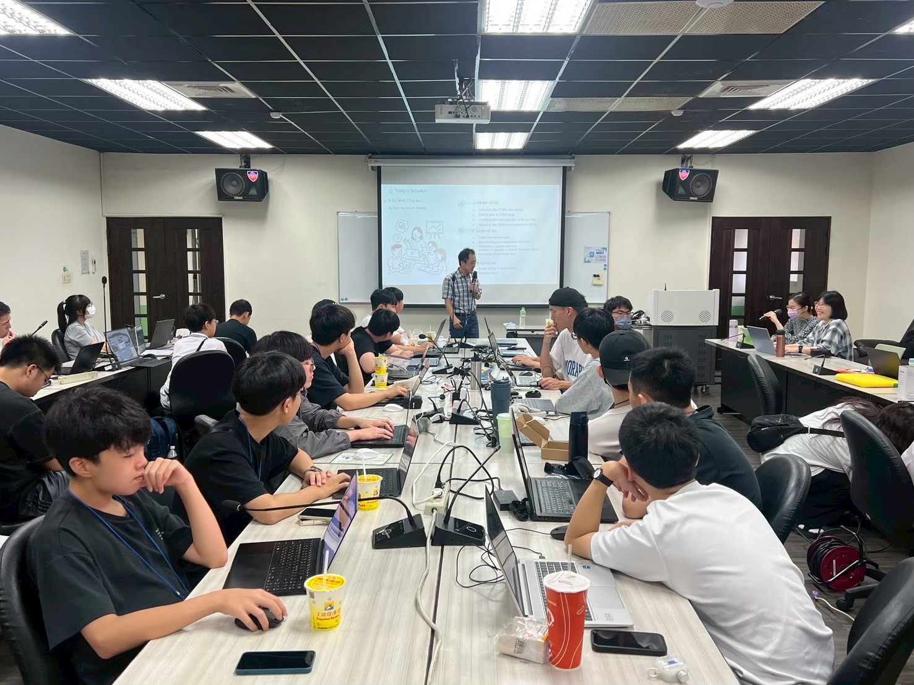
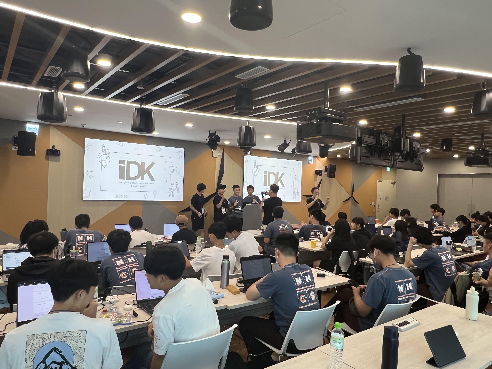
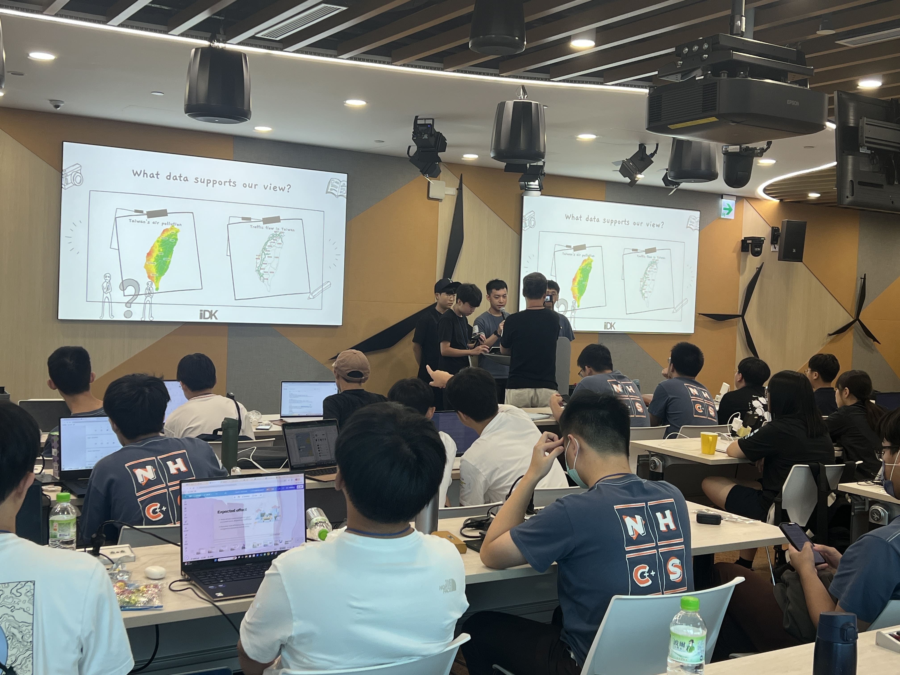
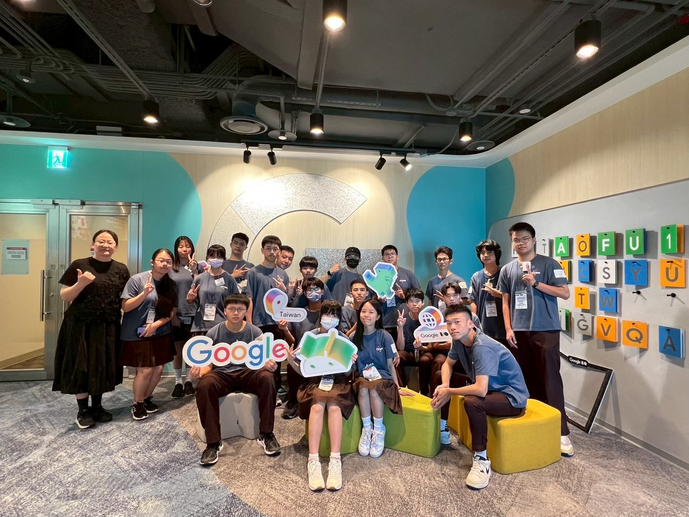
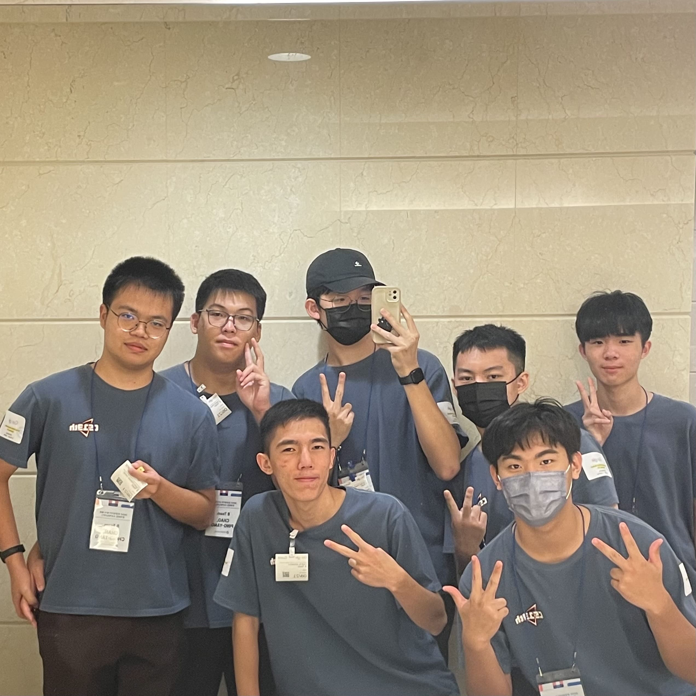
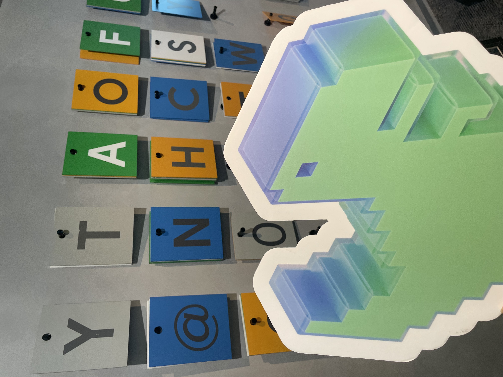
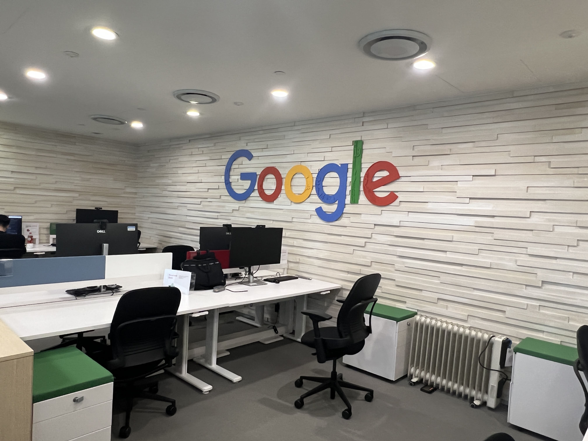
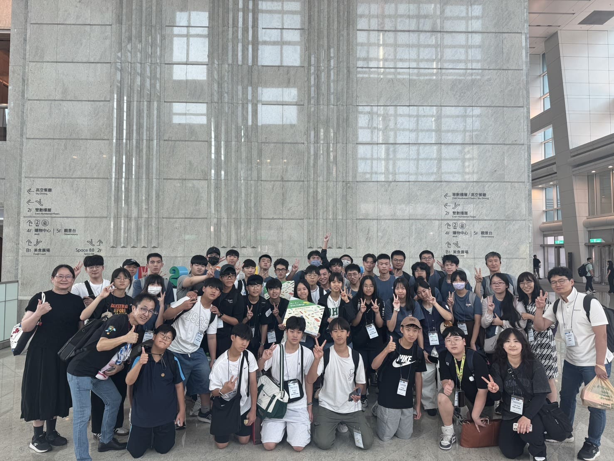

## 旅のあしあと

**参加者:** プサン（KR）の学生＆NHCS 13期生  
**指導者:** JP Park教授  
**会場:** NTNU（和平キャンパス）＆Google台北オフィス（台北101）

| 日付 | アクティビティ |
| --- | --- |
| 8月19日 | 異文化間アイスブレイキング＆オープンデータの基礎 |
| 8月20日 | ビッグデータプロジェクトの企画＆技術実装 |
| 8月21日 | 最終プロジェクトプレゼンテーション＆Google台北101訪問 |

* * *

## 国際協力とデータの本質

公式なイベントが始まる前に、基本的なツールの使い方に関する事前説明会がありました。情報工学科の学生としての私にとって、それはやや違和感がありました。初心者として指導されるような感覚は、韓国の学友と出会った後、国際協力への理解へと徐々に変わっていきました。内向的な人間として、言語の壁は当初のコミュニケーションを沈黙的にしてしまいましたが、デジタル世界では素早く共通言語を見つけることができました。DiscordとGoogle Chatのテキストを通じて、わずか中学3年生である韓国の後輩のプログラミング論理の深さに驚きました。年齢と国境を超えたこの技術的共鳴は、どんな言葉よりも説得力がありました。JP教授の文化的慣性を打ち破るオープニングダンスの後、私たちは台湾と韓国が共に直面する重いテーマに焦点を当てました：高い人口密度下での交通と大気汚染です。政府の公開データの抽出と地図の視覚化技術を通じて、データの流れの中から環境問題への解決策を見つけることを試みました。これは単なるデータ分析の実践ではなく、技術に社会的配慮を与える思考プロセスであり、冷たい数字から都市の呼吸を読む方法を教えてくれました。

## 専門家の視点と協力の重さ

3日目に台北101の77階にあるGoogleのオフィスに足を踏み入れた時、地平線を見下ろす壮大な感覚は、アマゾン訪問の以前の経験と相まって、将来のキャリアへの具体的な憧れを形成しました。現場のエンジニアとの対話は、外資企業の敷居への私の理解を再定義し、流暢なコミュニケーションと問題解決能力が、複雑な用語よりしばしば価値があることを明らかにしました。しかし、このイベントから最も深い衝撃は、最終的なプレゼンテーションステージで起きました。後輩が自発的にレポートを引き受けたため、私が怠けてしまった時、ステージ上の沈黙と突然のつっかえが、私の職務怠慢に目覚めさせました。その時の即座の救援の中で、チーム協力には傍観者がいてはならないこと、すべての成果物には全体の成功または失敗が関わっていることに気付きました。この経験は、過去の国際交流を逃す遺憾を埋めるだけでなく、技術を超えた自分の責任と可能性も見えました。今後、ビッグデータとAI分野への情熱を持ちながら、情報提示の効率性と創造性を継続的に洗練させ、近い将来、より成熟した姿勢でこのチャレンジに満ちた技術領域に入ることを願っています。

### 写真記録

-   事前説明会  
    
-   グループ写真  
    
-   真剣な授業..?翻訳は素晴らしい  
    
-   IDKグループプレゼンテーション  
    
-   緊急救助  
    
-   Googleオフィス クラス写真  
    
-   台北101の景色  
    
-   謎のトイレ写真  
    
-   Google恐竜  
    
-   Googleオフィス  
    
-   台北101集合写真  
    
